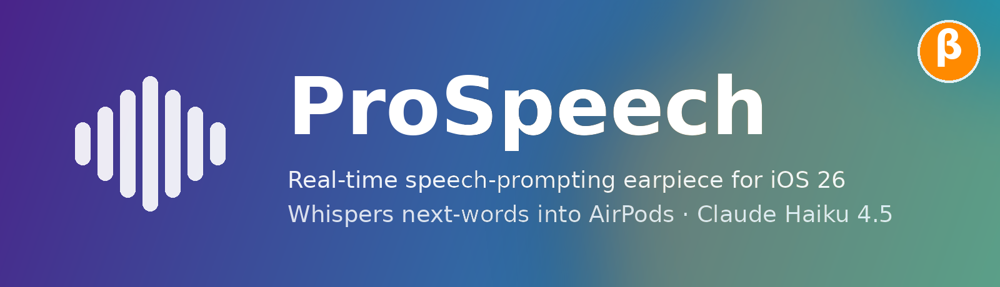
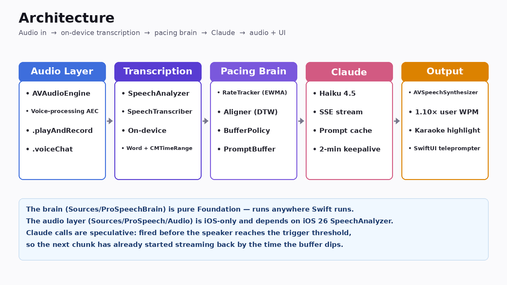
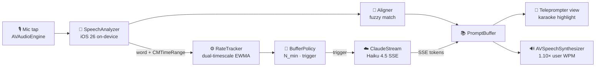
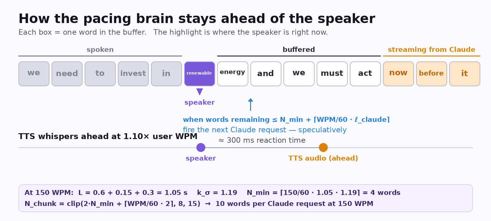

<p align="center">
  
</p>

<p align="center">
  <a href="https://github.com/LCoppers-Cloud/pro-speech/actions/workflows/ci.yml">
    
  </a>
  
  
  
  
</p>

---

## What it does

You put in AirPods, paste your speech notes, tap **Start**, and start talking.
ProSpeech listens on-device, watches your pace, and quietly whispers the next
few words into your ear *just before you need them*. The phone shows the same
words on screen with a karaoke-style highlight that tracks each word as you say
it — so you can glance, or not.

The trick is the **pacing brain**: it tracks your live speaking rate, fires the
next Claude request *speculatively* before the buffer runs low, and shapes each
chunk to match the time it takes Claude to respond. The audio arrives just in
time, not after a pause.

## Architecture

<p align="center">
  
</p>



The brain layer (`Sources/ProSpeechBrain`) is pure Foundation — no `UIKit`, no
`AVFoundation`, no platform-specific calls. It compiles and tests on any
platform Swift runs on, and the unit tests run with plain `swift test`. The iOS
audio layer (`Sources/ProSpeech/Audio`) is the thin shell that wires the brain
to `AVAudioEngine`, `SpeechAnalyzer`, and `AVSpeechSynthesizer`.

## How the pacing brain stays ahead of the speaker

<p align="center">
  
</p>

End-to-end latency from "speaker pauses" to "audio in their ear" is unavoidably
around a second — Claude TTFT ~600 ms + wire ~150 ms + Bluetooth SCO ~150 ms +
TTS first-audio ~150 ms. Waiting for a pause is too slow. So the brain fires
the next request *before* the buffer dips:

```
L          =  ℓ_claude + ℓ_tts + ℓ_safety           ≈ 1.05 s
k_σ        =  1 + z · σ/μ                            ≈ 1.19   (p90 headroom)
N_min      =  ⌈ WPM/60 · L · k_σ ⌉                   ≈ 4 words at 150 WPM
N_chunk    =  clip( 2·N_min + ⌈WPM/60·2⌉,  8,  15 )  ≈ 10 words
trigger    =  words_remaining ≤ N_min + ⌈WPM/60·ℓ_claude⌉
```

The TTS speaks at **1.10 × user WPM** so the whispered word lands ~300 ms
before the speaker reaches the spot it cues. Full derivation in [PACING.md](PACING.md).

## Project layout

```
pro-speech/
├── Package.swift              Brain modules as a Swift package — `swift test`-able
├── project.yml                XcodeGen spec for the iOS app target
├── PACING.md                  Equation derivations + A/B test list
├── Sources/
│   ├── ProSpeechBrain/        Pure Swift, no iOS deps
│   │   ├── RateTracker.swift    dual-timescale EWMA on syllables/sec
│   │   ├── Aligner.swift        skip-ahead fuzzy match
│   │   ├── BufferPolicy.swift   N_min · N_chunk · trigger threshold
│   │   ├── PromptBuffer.swift   ordered words + highlight cursor
│   │   ├── SpeakerProfile.swift persisted per-speaker stats
│   │   ├── SyllableCounter.swift heuristic syllable counter
│   │   ├── Persona.swift        tone presets
│   │   └── ClaudeStream.swift   Messages API SSE client + prompt cache
│   └── ProSpeech/             iOS app target, uses ProSpeechBrain
│       ├── ProSpeechApp.swift
│       ├── AppState.swift     coordinator
│       ├── Audio/             AVAudioEngine + SpeechAnalyzer + TTS
│       ├── Trigger/           silence detector
│       └── Views/             SwiftUI: Session, Notes, Tone, Settings
├── Tests/
│   └── ProSpeechBrainTests/
└── Resources/
    ├── Assets.xcassets/AppIcon.appiconset/  beta icons at every iPhone size
    └── Info.plist
```

## Build

Requires **macOS 26**, **Xcode 26**, **iOS 26 SDK**.

```bash
brew install xcodegen
xcodegen generate
open ProSpeech.xcodeproj
```

The brain logic can also be exercised without Xcode:

```bash
swift test
```

## Configuration

On first launch, open **Settings → Anthropic API key** and paste your key. It's
stored in the iOS Keychain and never leaves the device except when calling
`api.anthropic.com`. The app uses `claude-haiku-4-5` for speed and
prompt-caches your notes + persona for the duration of the session.

To start a speech: open the **Session** tab, tap **Start**, wait for the 3-2-1
countdown, and begin talking. The prompt buffer fills before you reach the end
of the first sentence.

## Status

Early scaffold. The brain layer and Claude client are implemented and
unit-tested; the audio + UI layer is wired but needs device-testing on iOS 26
hardware. CI runs `swift test` on the brain package + validates the XcodeGen
spec + attempts a best-effort iOS Simulator build.

## License

MIT — see [LICENSE](LICENSE).
